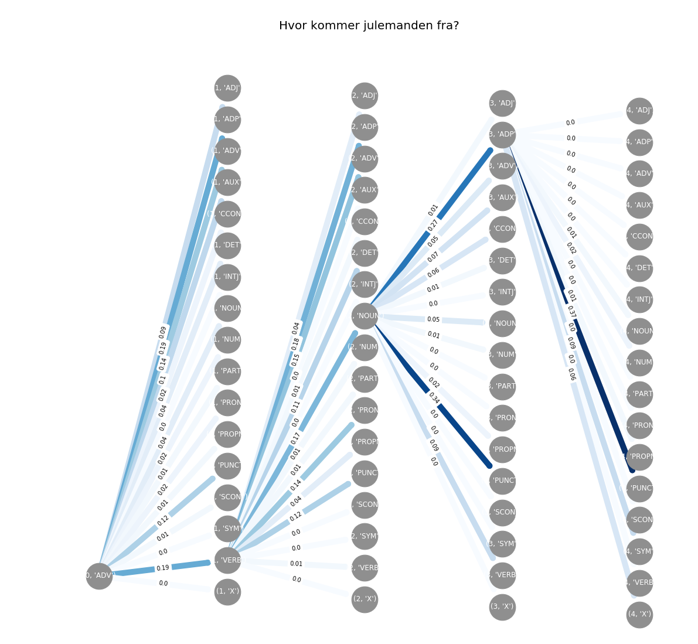

# Viterbi Decoding for POS-tagging from scratch

Visualization of the Viterbi algorithm for POS-tagging. Trained on data from the [Universal Dependecy Treebank](https://github.com/UniversalDependencies/UD_Danish-DDT). 

### Requires

```python
pip install streamlit
```

### Run

```python
streamlit run hmm_viterbi_st.py
```

### Metrics

| **Most likely**         |        |
| ----------------------- | ------ |
| Sentence level accuracy | 7.62%  |
| Word level accuracy     | 78.89% |
| **Viterbi**             |        |
| Sentence level accuracy | 16.31% |
| Word level accuracy     | 76.26% |



